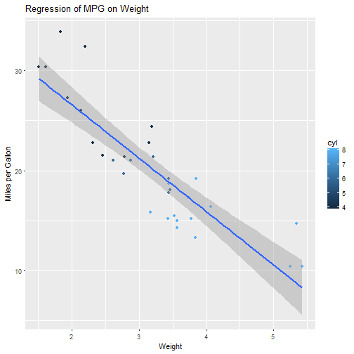

<style>
body {
    overflow: scroll;
}

.small-code pre code {
  font-size: 1em;
}

</style>

SBERBANK Opendata plotter
========================================================
author: Ilya Krasnikov
date: 13.10.2017
autosize: True

Overview
========================================================

This presentation was prepared for the **Course Project: Shiny Application and Reproducible Pitch**

The shiny app developed for this assignment is avalilable: https://drpooh.shinyapps.io/Sberbank_Opendata/

The source codes of ui.R and server.R and also R Presentation are available on the GitHub repo: https://github.com/ivkrasnikov/Shiny-Application-and-Reproducible-Pitch/

Sberbank occupies 40% to 90% of the financial services market, depending on the region and product in Russia. It analyze data on 140 million private and 1.5 million corporate customers.
"Big Data" of Sberbank is information about partial economic processes taking place in the country. For the first time, these data become available at [Opendata Sberbank](http://www.sberbank.com/ru/opendata) and [Official site on English](http://www.sberbank.com)

Available data
========================================================

* Revenue of legal entities by industries and regions
* The income level of the population - salaries, pensions, grants, allowances
* Propensity to save and consume
* Level of crediting in different regions
* Mobility of the population at home and abroad
* The share of expenses for food, housing and communal services, transport and other items

***
The app has several inputs to manipulate the data and plot. A user can select a measurement, region and period. 


How it works
========================================================

The app has several inputs to manipulate the data and plot. A user can select a measurement, region and period.
* Select a region of interest
* Select a variable (information about partial economic processes)
* Select a period of interest:
  + Date range - specifies the begining date and end dates of showing data.
  + Years - a slider that specifies the years of showing data.
  + From the year begin - a slider that specifies from the begin of which year to show the data.
  + Finally, All the time - showing the data for all the time.

The user also could select an approximation model for the showing data:
* Auto - the plot generates an approximation curve automatically
* Linear model - the plot generates Linear approximation model curve
* Poly model - the plot generates polynom model curve for the presented data

The R code
========================================================
class: small-code

In this slide we show how to include R code embedded in the slide.
As the data store in exteral file, let use R library.
The App uses ggplot tool for plotting the data, like following 


```r
library(ggplot2)
data('mtcars')

qplot(wt, mpg, data=mtcars, geom=c("point", "smooth"),
   method="lm", formula=y~x, color=cyl,
   main="Regression of MPG on Weight",
   xlab="Weight", ylab="Miles per Gallon")
```




